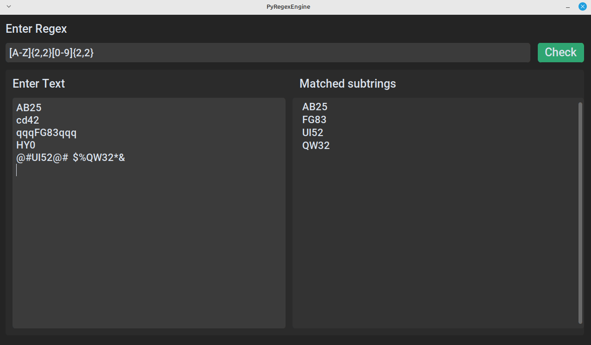
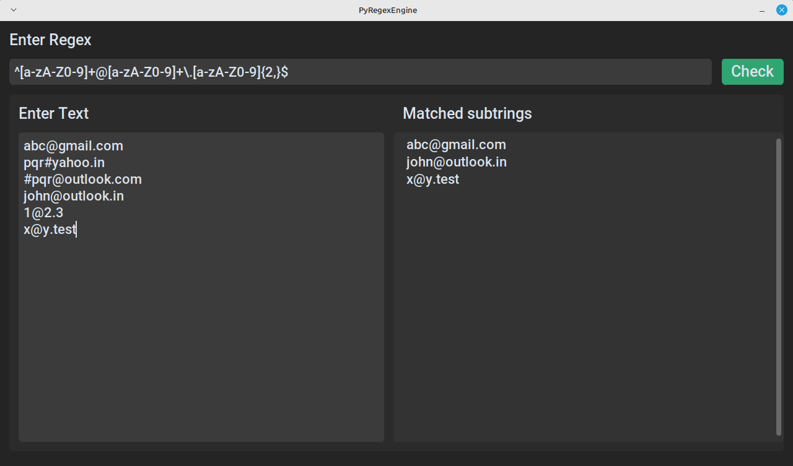

# PyRegexEngine
A Regex Engine made with python, GUI with CustomTkinter.

### How to run
1. Install packages using requirements.txt
2. Run gui.py

Note: Virtual environment recommended

### Supported features
1. '*', '+', '?' and '{}' Operators.
2. String literals, Wildcard('.'), and Square Brackets([])
3. Ranges (a-z, A-Z, 0-9) and Inversion(^) in square brackets.
4. String Start (^) and End ($)

### Examples
 
